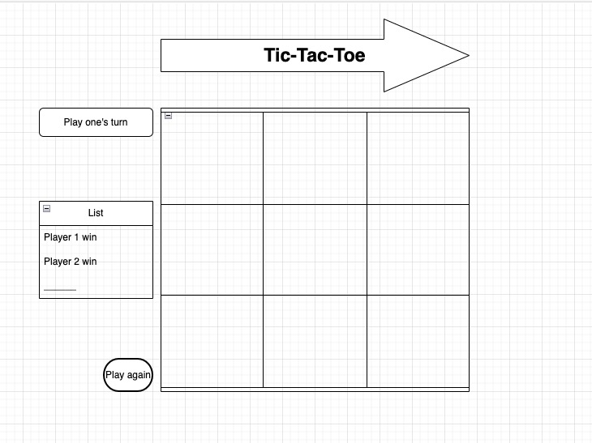

# Project: Tic Tac Toe

## Preview

Experience the classic game of Tic Tac Toe with a modern twist. Dive into a visually captivating interface with dynamic background colors that change with every move. Be enthralled by the wiggling title animation and enjoy the game with well-defined status messages.

## Technology Used
- HTML
- CSS
- Vanilla JavaScript

## Approach
The game adopts a 3x3 grid layout that embodies the classic Tic Tac Toe board. Players can click on any cell to place their marker ("X" or "O"). The entire game logic is handled through JavaScript with the game board's state maintained in an array.

### Game Design:
1. **Dynamic Background**: The game's background color changes in tandem with the current player—red for "X" and blue for "O".
2. **Wiggling Title**: The main title comes alive with a wiggle animation, adding an element of dynamism to the game's design.
3. **Game Board**: The board is designed as a grid of circular cells, offering a fresh take on the traditional Tic Tac Toe design.

### How I Solved for the Winner:
The game's state is stored in an array. This array is cross-referenced with predefined winning combinations (rows, columns, diagonals). When any of these combinations align with a player's symbols, a win is registered, and the user is greeted with a winning message.

## Features
- **Animated Game Title**: The title exhibits a unique wiggle animation that adds flair to the game.
- **Dynamic Background**: Background color transitions with the player turns, enhancing the user experience.
- **Game Status Messages**: Clear and concise messages keep players informed about game outcomes.
- **Restart Game**: Players can effortlessly reset the game with a dedicated button, eliminating the need to refresh the page.

## User Stories
- As a user, I should be able to start a new tic-tac-toe game.
- As a user, I should be able to click on a square to add "X" first and then "O", and so on.
- As a user, I should be shown a message after each turn indicating if I win, lose, tie, or informing whose turn it is next.
- As a user, I should not be able to click the same square twice.
- As a user, I should be shown a message when I win, lose, or tie.
- As a user, I should not be able to continue playing once I win, lose, or tie.
- As a user, I should be able to play the game again without refreshing the page.

## Future Iterations
- Introduce an AI opponent for a single-player mode.
- Enhance game visuals with additional animations or design themes.
- Offer difficulty levels for the AI opponent.
